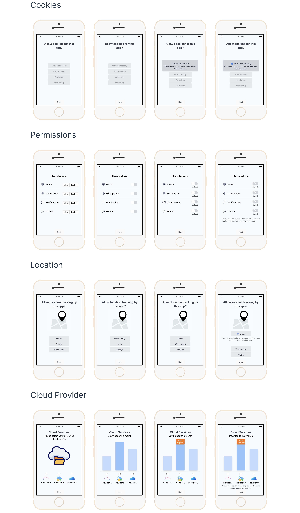

# NudgeApp

## What is it?

NudgeApp is a user interface (UI) designed for conducting experimental studies related to behavioral nudges in the fields of Human-Computer Interaction (HCI) and psychology. It provides a flexible platform to present different experimental conditions and collect data, facilitating research into how subtle design changes can influence user behavior.

Try the UI online on [GitHub Pages](https://ca1yz.github.io/nudge-app/)!

<div align="center">
  
</div>

## Installation

Now this repo contains frontend only. Run the installation commands to test it out!

<!-- To get the NudgeApp running, you will typically need a backend service that the UI can communicate with. However, the application includes a demo mode for frontend-only development or testing.

*   **Backend Dependency:** The application is designed to interact with a backend. Ensure your backend service is running and accessible. The target URL for the backend is configured in `vite.config.js`.
*   **Demo Mode:** You can run the app without a backend by setting `isDemo` to `true` in the `config.jsx` file located in the project root. In demo mode, the app uses randomized settings and does not require a backend connection.
*   **Content Buffering:** The `bufferPages` setting in `config.jsx` controls the text content displayed in the application. You can adjust this to manage the flow and content of your experiments. -->

### Prerequisites

*   Node.js (version 18)
*   npm (Node Package Manager, which comes with Node.js)

```bash
git https://github.com/ca1yz/nudge-app.git
cd nudge-app
npm install
```

### Running the Application

To run the application, use the following command:

```bash
npm run dev
```

Now you should find the UI by visiting `http://localhost:5173/` in the browser.
